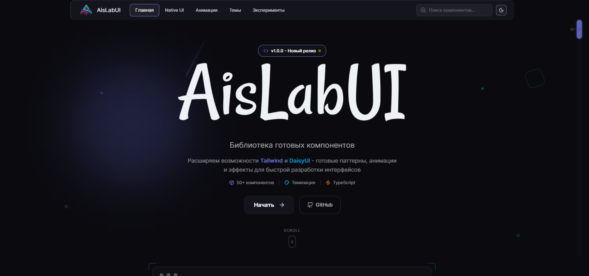
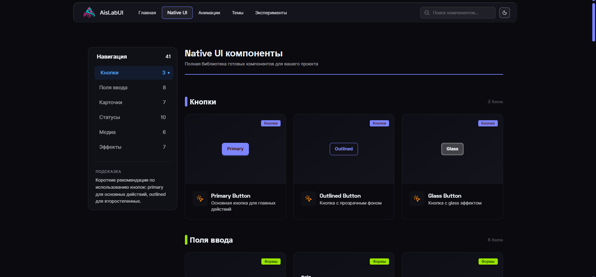
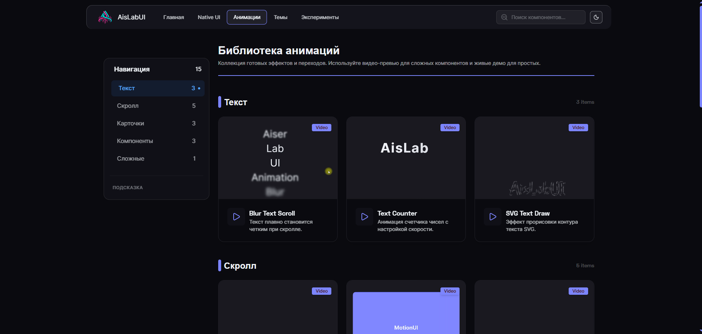
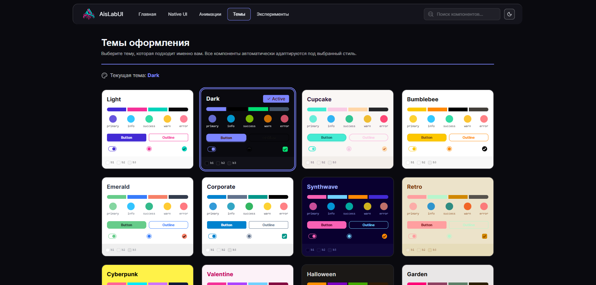

<p align="center">
  
</p>

<h1 align="center">@aislab/ui-kit</h1>

<p align="center">
  <a href="https://www.npmjs.com/package/@aislab/ui-kit">
    
  </a>
  <a href="https://github.com/AiserKz/AisLabUI/blob/main/LICENSE">
    
  </a>
  
  
</p>

---

## 🇷🇺 Русский (Russian)

**Source-based UI Kit, построенный на базе Tailwind CSS и daisyUI.**  
Готовые компоненты с полной кастомизацией: меняйте цвета, скругления, отступы - всё редактируется прямо в вашем проекте.

### 📥 Установка (Installation)

| Тип        | Команда                     | Описание                            |
| :--------- | :-------------------------- | :---------------------------------- |
| **Native** | `npx @aislab/ui-kit native` | Установка стандартных компонентов   |
| **Motion** | `npx @aislab/ui-kit motion` | Установка анимированных компонентов |
| **Force** | `npx @aislab/ui-kit <type> --force` | Установка игнорируя зависимости |

### 💎 Особенности (Features)

| Особенность      | Описание                                                  |
| :--------------- | :-------------------------------------------------------- |
| **Customizable** | Полный доступ к исходному коду, правьте всё под себя.     |
| **Hybrid**       | Содержит как стандартные, так и анимированные компоненты. |
| **Direct Path**  | Компоненты устанавливаются в `src/components/ui/`.        |
| **Open Source**  | Свободная лицензия MIT для любых проектов.                |

### 🛠 Зависимости (Dependencies)

| Пакет                                           | Версия | Назначение                   |
| :---------------------------------------------- | :----- | :--------------------------- |
| [Tailwind CSS](https://tailwindcss.com/)        | ^3.x   | Основной движок стилизации   |
| [daisyUI](https://daisyui.com/)                 | ^4.x   | Библиотека UI компонентов    |
| [Framer Motion](https://www.framer.com/motion/) | ^11.x  | Анимации (только для motion) |

### 🚀 Пример использования

```tsx
import { Button } from "@/components/ui/Button";

export default function App() {
  return <Button className="btn-primary">AisLab Button</Button>;
}
```

---

## 📸 Скриншоты (Screenshots)

<p align="center">
  
  
    
  
</p>
(Другие скриншоты в папке docs)
---

## 🇺🇸 English

**Source-based UI Kit built on top of Tailwind CSS and daisyUI.**  
Ready-to-use components with full customization: change colors, border-radius, spacing - everything is editable directly in your project.

### 📥 Installation

| Type       | Command                     | Description                 |
| :--------- | :-------------------------- | :-------------------------- |
| **Native** | `npx @aislab/ui-kit native` | Install standard components |
| **Motion** | `npx @aislab/ui-kit motion` | Install animated components |
| **Force** | `npx @aislab/ui-kit <type> --force` | Install ignoring dependencies |


### 💎 Features

| Feature          | Description                                   |
| :--------------- | :-------------------------------------------- |
| **Customizable** | Full access to source code, edit everything.  |
| **Hybrid**       | Includes both standard and motion components. |
| **Direct Path**  | Installed directly into `src/components/ui/`. |
| **Open Source**  | MIT Licensed for all types of projects.       |

### 🛠 Dependencies

| Package                                         | Version | Purpose                  |
| :---------------------------------------------- | :------ | :----------------------- |
| [Tailwind CSS](https://tailwindcss.com/)        | ^3.x    | Core styling engine      |
| [daisyUI](https://daisyui.com/)                 | ^4.x    | UI component library     |
| [Framer Motion](https://www.framer.com/motion/) | ^11.x   | Animations (motion only) |

### 🚀 Usage Example

```tsx
import { Button } from "@/components/ui/Button";

export default function App() {
  return <Button className="btn-primary">AisLab Button</Button>;
}
```

---

## 📄 License

MIT License. Built on top of [daisyUI](https://daisyui.com/).
